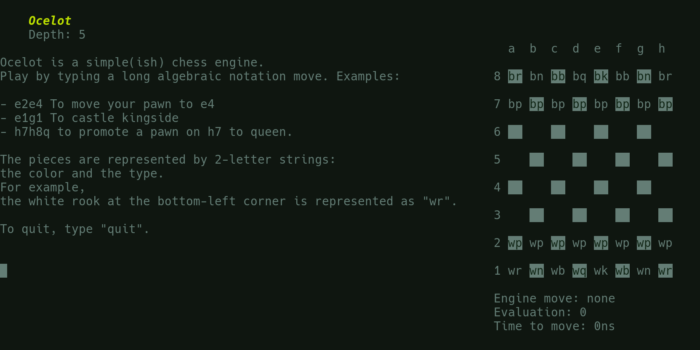

    <h1>Ocelot</h1>
    
Ocelot is a chess engine that implements the Universal Chess Interface.

    

# Features
Ocelot has a bunch of features, including:
- Simple UCI implementation: compatible with most GUIs
- Built-in TUI: works out-of-the-box
- Efficient search algorithm: Finds moves in about 7.5 seconds

# Usage
To use Ocelot with a 3rd-party user interface in UCI mode, just start it from the command line.

If you pass a number as an argument, it sets the engine's depth to that number.

# How the cat runs
Ocelot doesn't use any 3rd-party libraries. Its only dependency is the Rust standard library.

When you start the engine with no arguments, it starts in UCI mode. UCI (Universal Chess Interface) is a protocol defining how chess engines and user interfaces communicate. It defines how moves should be represented (like `e2e4`) and how positions should be represented.

After the UI tells Ocelot to find the best move in a position, it scans the board for pieces of its side's color. Instead of inefficiently checking all 64 squares on the board, it keeps a `vector` (list) of the coordinates of squares with pieces. Next, after it has found all of its pieces, it iterates through all of them and finds their potential moves. *Potential* moves are distinct from *legal* moves in that they haven't been checked for legality. They are simply moves that don't collide with the end of the board and don't illegally capture a piece. This distinction is important because you can only filter for legality after you have all potential moves. The reason is simple: in chess, any move is legal as long as it doesn't put you in check, and you can't know if your king is threatened until you know where your opponent's pieces can go.

After all these potential moves have been found, Ocelot starts its search algorithm. This is the recursive logic that looks at all possible boards resulting from all possible moves, and chooses the move that leads to the greatest outcome.

This algorithm iterates through all potential moves. If it finds an illegal move, it continues to the next. Otherwise, it creates a new board that this legal move has been played on. This new board is then evaluated and the algorithm calls itself on this new child node. This continues until either the target depth is reached, the game is over, or a node is determined worse than the current best and [pruned](https://www.chessprogramming.org/Alpha-Beta) from the tree and its search returns early. If this simple alpha-beta cutoff logic weren't present, searching the current position would be *much* slower.

# Acknowledgements
As I mentioned above, Ocelot doesn't have any dependencies. However, that doesn't mean that I didn't receive massive help from a number of sources:

- The [Chess Programming Wiki](https://www.chessprogramming.org/Main_Page) was extraordinarily helpful when researching search algorithms and how chess engines are built in general.
- [Wikipedia](https://en.wikipedia.org/wiki/Alpha%E2%80%93beta_pruning#Pseudocode), especially the linked page, was a cheat code. My search algorithm is essentially their pseudocode translated to Rust.
- Honorable mention to the ever-invaluable [ansi code cheatsheet from ConnerWill](https://gist.github.com/ConnerWill/d4b6c776b509add763e17f9f113fd25b).
